<div align="center">

# 🚀 Pump.fun Intelligence Platform

**Professional Solana Trading Intelligence System**

*Detect smart money clusters BEFORE tokens pump.*

[](https://opensource.org/licenses/MIT)
[](https://www.python.org/downloads/)
[](https://solana.com/)
[](https://docker.com/)

---

**Stop trading blind. Start trading with intelligence.**

</div>

---

## 📋 Table of Contents

- [Overview](#-overview)
- [How It Works](#-how-it-works)
- [System Architecture](#-system-architecture)
- [Features](#-features)
- [Quick Start](#-quick-start)
- [Configuration](#-configuration)
- [API Reference](#-api-reference)
- [Trading Flows](#-trading-flows)
- [Database Schema](#-database-schema)
- [Project Structure](#-project-structure)
- [Pro Tips](#-pro-tips)
- [Roadmap](#-roadmap)
- [Contributing](#-contributing)

---

## 💡 Overview

### The Problem

```
❌ You see a token pumping  →  Already too late
❌ You buy at the peak      →  Lose money  
❌ You miss the 10x         →  Watch from sidelines
```

### The Solution

```
✅ Platform detects 15 wallets (73% win rate) buying $TOKEN
                              ↓
✅ Alert sent to your Telegram in <10 seconds
                              ↓
✅ You buy 5 minutes BEFORE the pump
                              ↓
✅ Token pumps 3x in 30 minutes
                              ↓
                        💰 PROFIT
```

> **The 5-15 minute time advantage is the difference between profit and loss.**

---

## 🔄 How It Works

### Cluster Detection Pipeline

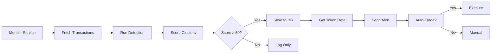

### Detailed Detection Flow

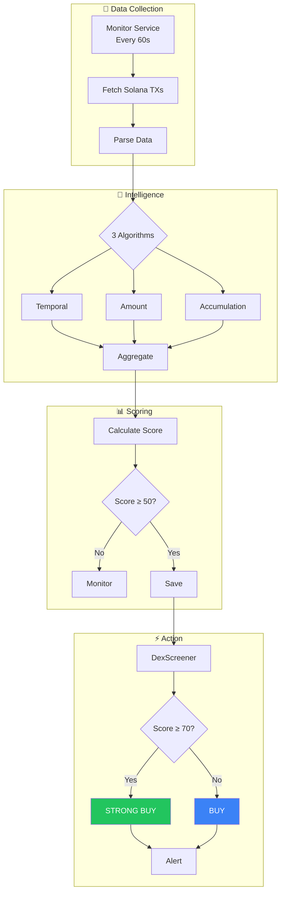

### Scoring System

| Score | Signal | Action |
|:-----:|:------:|:-------|
| **70-100** | 🟢 STRONG_BUY | Immediate action recommended |
| **50-69** | 🔵 BUY | Monitor for entry point |
| **0-49** | ⚪ MONITOR | Track for potential movement |

**Score Components:**
- Base score from wallet count
- Bonus for smart money wallets (60%+ win rate)
- Bonus for high total volume
- Bonus for tight time clustering (<5 min)
- Bonus for amount similarity (coordinated)

---

## 🏗 System Architecture

### High-Level Overview

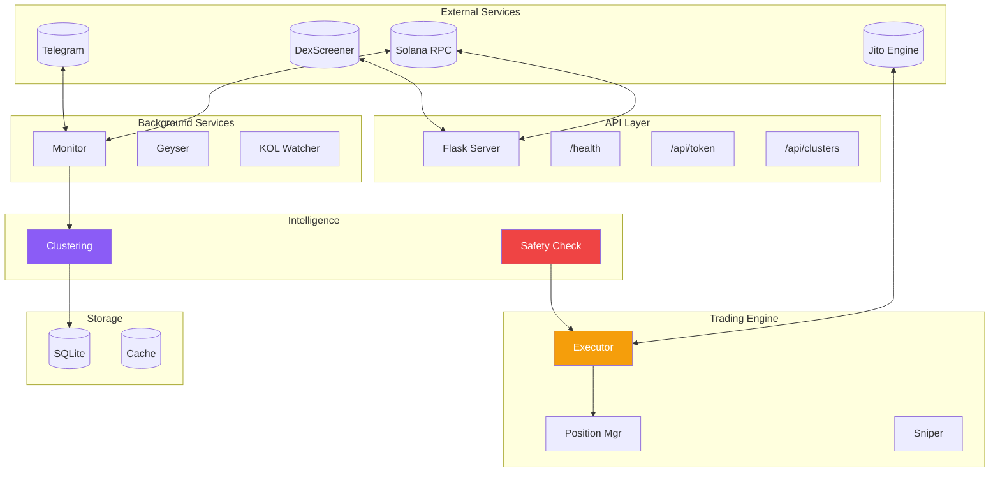

### Service Communication

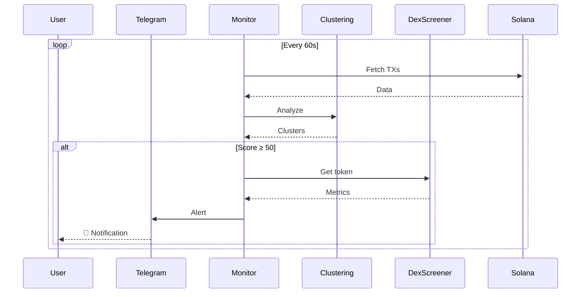

---

## ✨ Features

### 🧠 Smart Money Detection

Three sophisticated algorithms detect coordinated wallet activity:

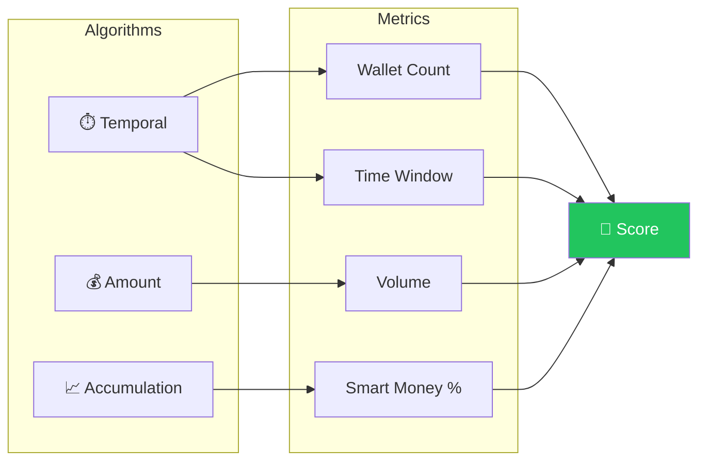

| Algorithm | What It Detects | Signal Strength |
|:----------|:----------------|:---------------:|
| **Temporal** | Wallets buying within 5-min windows | High |
| **Amount Similarity** | Coordinated bot/insider buys | Medium |
| **Early Accumulation** | Mass buying before volume spike | High |

### 🚀 Graduation Detection

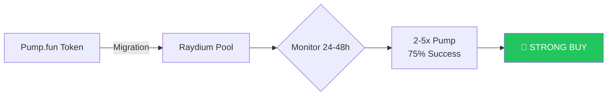

### 🛡️ Safety System

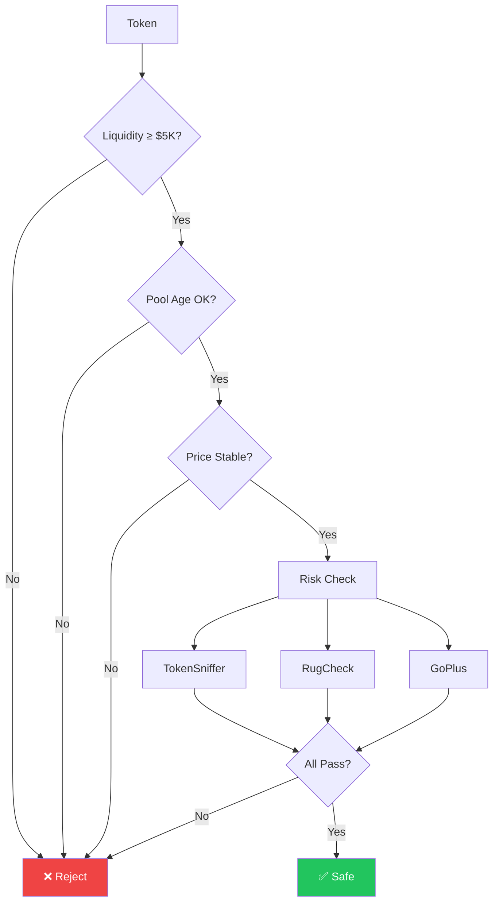

### ⚡ Execution Paths

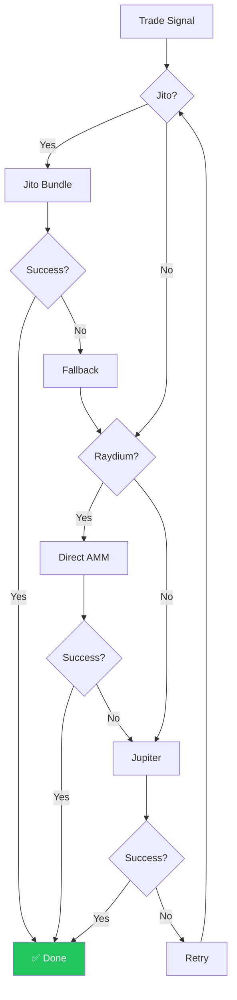

---

## 🚀 Quick Start

### Prerequisites

- Python 3.11+
- Solana RPC endpoint
- Telegram Bot Token (optional)

### Docker (Recommended)

```bash
# Clone
git clone https://github.com/yourusername/pumpfun-intelligence.git
cd pumpfun-intelligence

# Configure
cp backend/.env.example backend/.env
# Edit .env with your settings

# Start
docker-compose up -d

# Logs
docker-compose logs -f
```

### Manual Installation

```bash
# Clone
git clone https://github.com/yourusername/pumpfun-intelligence.git
cd pumpfun-intelligence/backend

# Virtual environment
python -m venv venv
source venv/bin/activate  # Linux/Mac

# Install
pip install -r requirements.txt

# Configure
cp .env.example .env
# Edit .env

# Run API
python src/main_integrated.py

# Run Monitor (new terminal)
python src/monitor_service.py
```

### Verify

```bash
curl http://localhost:5000/health
```

```json
{
  "status": "healthy",
  "features": {
    "database": true,
    "dexscreener": true,
    "clustering": true,
    "telegram": true
  }
}
```

---

## ⚙️ Configuration

### Environment Variables

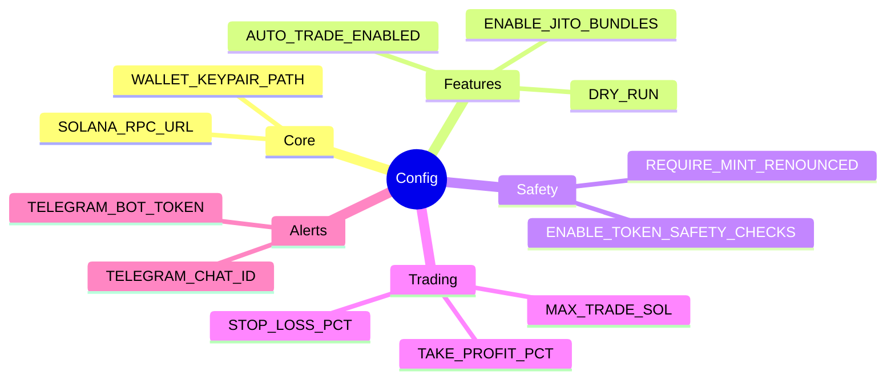

### Core Settings

```bash
# RPC
SOLANA_RPC_URL=https://api.mainnet-beta.solana.com
FALLBACK_RPC_1=https://backup-rpc.com

# Wallet (choose one)
WALLET_KEYPAIR_PATH=/path/to/keypair.json
WALLET_PRIVATE_KEY=base58_key
```

### Feature Flags

```bash
AUTO_TRADE_ENABLED=true    # Auto trading
DRY_RUN=false              # Simulate only
KILL_SWITCH=false          # Emergency stop
ENABLE_JITO_BUNDLES=false  # Fast execution
ENABLE_RAYDIUM_DIRECT=true # Direct swaps
```

### Safety Settings

```bash
ENABLE_TOKEN_SAFETY_CHECKS=true
REQUIRE_MINT_RENOUNCED=true
REQUIRE_FREEZE_RENOUNCED=true
MIN_LIQUIDITY_USD=5000
MAX_PRICE_IMPACT_BPS=500
```

### Trading Parameters

```bash
MAX_TRADE_SOL=1.0
DEFAULT_SLIPPAGE_BPS=100
TAKE_PROFIT_PCT=100    # 2x target
STOP_LOSS_PCT=25       # 25% max loss
TRAILING_STOP_PCT=15   # Trail by 15%
MAX_HOLD_MINUTES=120
```

### Telegram Setup

```bash
TELEGRAM_BOT_TOKEN=123456:ABC-DEF...
TELEGRAM_CHAT_ID=123456789
```

**How to get credentials:**

1. Message [@BotFather](https://t.me/BotFather) → `/newbot`
2. Copy bot token
3. Message your bot
4. Visit: `https://api.telegram.org/bot<TOKEN>/getUpdates`
5. Copy `chat_id`

---

## 📡 API Reference

### Endpoints

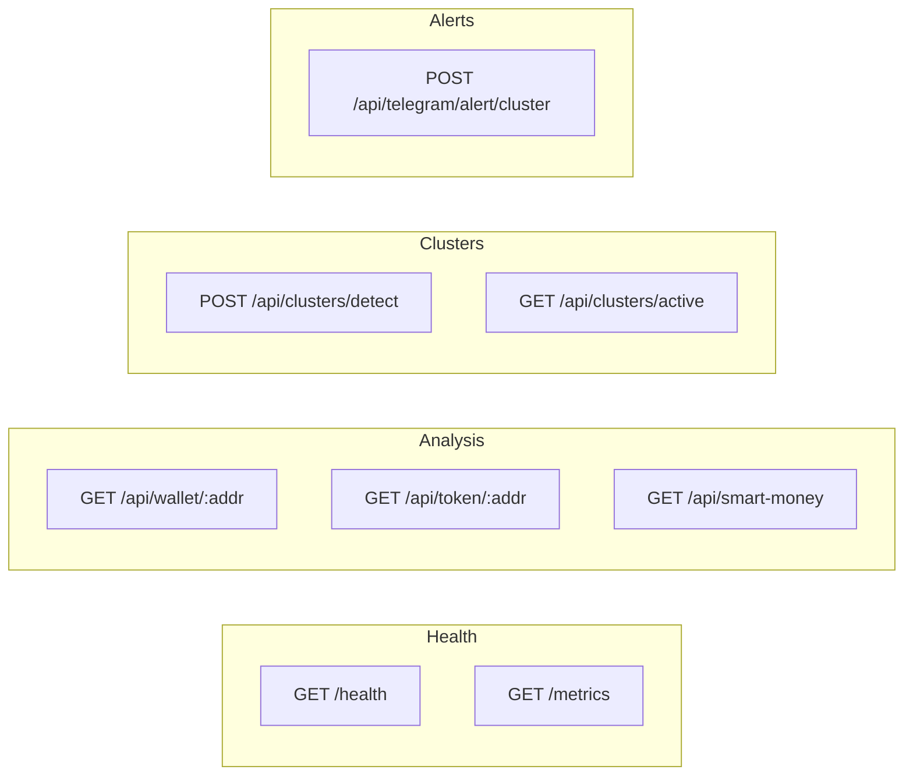

### Reference

| Method | Endpoint | Description |
|:------:|:---------|:------------|
| GET | `/health` | Health check |
| GET | `/api/wallet/<addr>` | Wallet analysis |
| GET | `/api/token/<addr>` | Token data |
| POST | `/api/clusters/detect` | Detect clusters |
| GET | `/api/clusters/active` | Active clusters |
| GET | `/api/smart-money` | Top wallets |
| GET | `/metrics` | Prometheus metrics |

### Examples

```bash
# Token analysis
curl http://localhost:5000/api/token/TOKEN_ADDRESS

# Detect clusters
curl -X POST http://localhost:5000/api/clusters/detect \
  -H "Content-Type: application/json" \
  -d '{"hours": 1}'

# Active clusters
curl http://localhost:5000/api/clusters/active

# Smart money
curl "http://localhost:5000/api/smart-money?limit=50"
```

---

## 🔄 Trading Flows

### Auto-Trade Decision

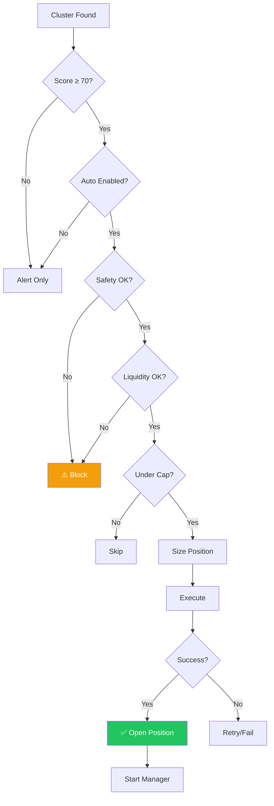

### Position Exit Logic

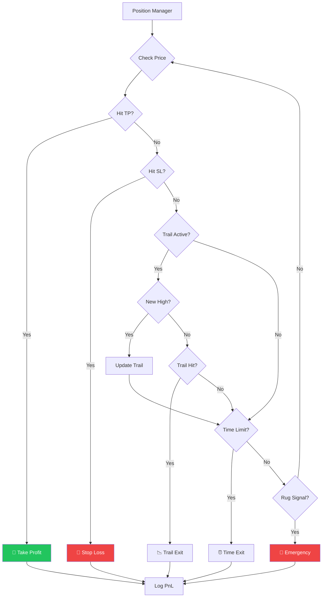

---

## 💾 Database Schema

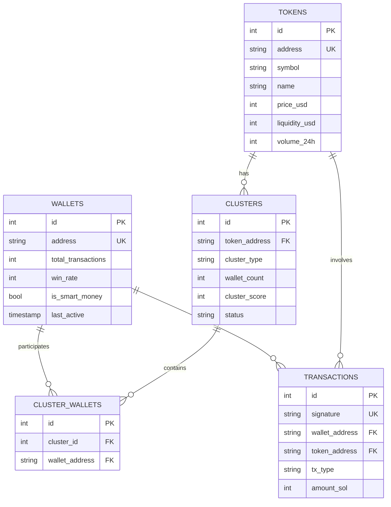

---

## 📁 Project Structure

```
pumpfun-intelligence/
├── backend/
│   ├── src/
│   │   ├── main_integrated.py       # 🌐 Flask API
│   │   ├── monitor_service.py       # 👁️ Real-time monitor
│   │   ├── clustering_service.py    # 🧠 Detection engine
│   │   ├── database.py              # 💾 SQLite
│   │   ├── dexscreener_api.py       # 📊 Token data
│   │   ├── telegram_service.py      # 📱 Notifications
│   │   ├── solana_api.py            # 🔗 Blockchain
│   │   ├── executor.py              # ⚡ Trade execution
│   │   ├── position_manager.py      # 💼 Positions
│   │   ├── raydium_direct/          # 🔄 AMM swaps
│   │   │   ├── pool_parser.py
│   │   │   ├── amm_math.py
│   │   │   └── ix_builder.py
│   │   ├── trading/                 # 💰 Trading utils
│   │   │   ├── sizing.py
│   │   │   ├── fee_tuner.py
│   │   │   ├── token_safety.py
│   │   │   └── metrics.py
│   │   └── risk_sources.py          # 🛡️ Risk checks
│   ├── logs/
│   ├── requirements.txt
│   ├── Dockerfile
│   └── .env.example
├── docker-compose.yaml
└── README.md
```

---

## 💡 Pro Tips

| # | Tip | Why |
|:-:|:----|:----|
| 1 | **Act Fast** | 5-15 minute window |
| 2 | **Trust 70+ Scores** | Strong signals |
| 3 | **Watch Graduations** | Most profitable |
| 4 | **Avoid < $5K Liquidity** | Rug risk |
| 5 | **Follow Smart Money** | 60%+ win rates |
| 6 | **Use Telegram Alerts** | Don't miss trades |
| 7 | **Take Profits at 2-3x** | Don't be greedy |
| 8 | **Always Use Stop Loss** | Protect capital |
| 9 | **Start Small** | Test first |
| 10 | **Track Everything** | Analyze performance |

---

## 📈 Roadmap

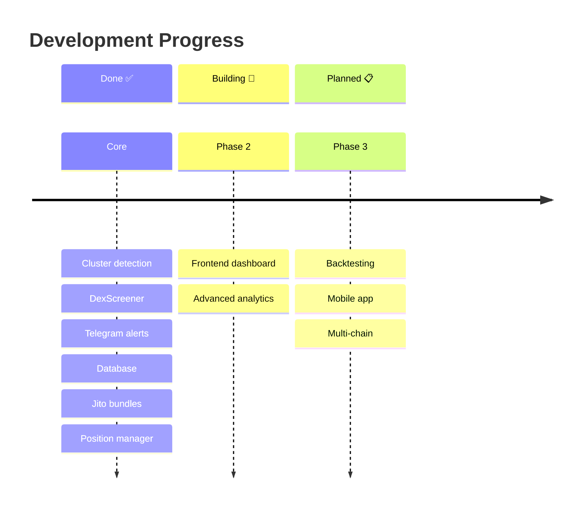

---

## 🤝 Contributing

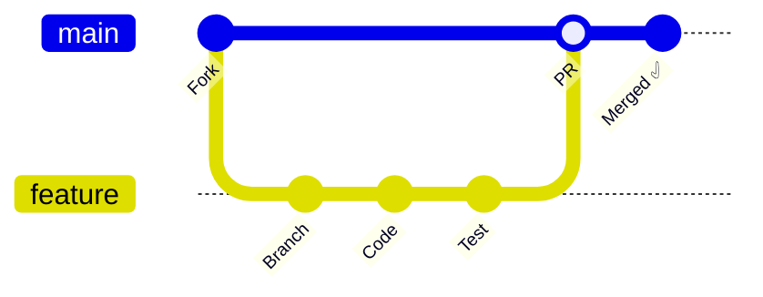

1. Fork the repository
2. Create feature branch: `git checkout -b feature/name`
3. Make changes
4. Test thoroughly
5. Submit pull request

---

## ⚠️ Disclaimer

> **Educational and informational purposes only.**
> 
> Cryptocurrency trading involves substantial risk. This platform provides signals and automation but does not guarantee profits.
> 
> **Always:**
> - Do your own research (DYOR)
> - Never invest more than you can afford to lose
> - Test with small amounts first

---

## 📝 License

MIT License - See [LICENSE](LICENSE) file.

---

## 📞 Support

- **Issues**: GitHub Issues
- **Docs**: `/docs` folder
- **Community**: Telegram (coming soon)

---

<div align="center">

**Stop trading blind. Start trading with intelligence.** 🚀💰

*Built with intelligence. Designed for profit.*

</div>
