<](https://opensource.org/licenses/MIT)
[](https://www.python.org/downloads/)
[](https://solana.com/)
[](https://docker.com/)

</div>

---

## 📋 Table of Contents

- [Overview](#-overview)
- [How It Works](#-how-it-works)
- [System Architecture](#-system-architecture)
- [Features](#-features)
- [Quick Start](#-quick-start)
- [Configuration](#-configuration)
- [API Reference](#-api-reference)
- [Monitoring & Metrics](#-monitoring--metrics)
- [Trading Flows](#-trading-flows)
- [Database Schema](#-database-schema)
- [Project Structure](#-project-structure)
- [Roadmap](#-roadmap)
- [Contributing](#-contributing)
- [Disclaimer](#-disclaimer)

---

## 💡 Overview

### The Problem

```
You see a token pumping → Already too late
You buy at the peak    → Lose money  
You miss the 10x       → Watch from sidelines
```

### The Solution

```
Platform detects 15 wallets (73% win rate) buying $TOKEN
            ↓
Alert sent to your Telegram in <10 seconds
            ↓
You buy 5 minutes BEFORE the pump
            ↓
Token pumps 3x in 30 minutes
            ↓
        💰 PROFIT
```

**The 5-15 minute time advantage is the difference between profit and loss.**

---

## 🔄 How It Works

### Cluster Detection Flow

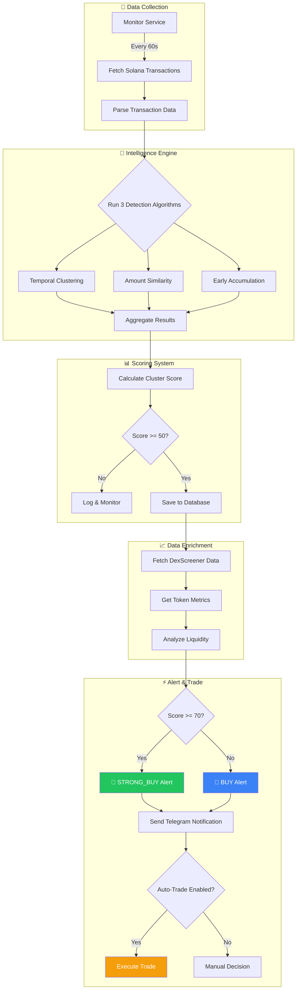

### Scoring System

| Score Range | Signal | Action |
|:-----------:|:------:|:-------|
| **70-100** | 🟢 STRONG_BUY | Immediate action recommended |
| **50-69** | 🔵 BUY | Monitor for entry point |
| **0-49** | ⚪ MONITOR | Track for potential movement |

---

## 🏗 System Architecture

### High-Level Overview

```mermaid
graph TB
    subgraph External["☁️ External Services"]
        SOL[("🔗 Solana RPC")]
        DEX[("📊 DexScreener API")]
        JITO[("⚡ Jito Block Engine")]
        TG[("📱 Telegram Bot API")]
        PYTH[("💱 Pyth Price Feeds")]
    end

    subgraph Core["🎯 Core Platform"]
        subgraph API["Flask API Server"]
            MAIN[main_integrated.py]
            HEALTH[/health]
            WALLET[/api/wallet]
            TOKEN[/api/token]
            CLUSTER[/api/clusters]
            METRICS[/metrics]
        end

        subgraph Services["Background Services"]
            MON[Monitor Service]
            GEYSER[Geyser Watcher]
            KOL[KOL Watcher]
            BUNDLE[Bundle Detector]
        end

        subgraph Trading["Trading Engine"]
            EXEC[Trade Executor]
            SNIPE[Snipe Executor]
            KOLSNIPE[KOL Sniper]
            BUNDLESNIPE[Bundle Sniper]
            POS[Position Manager]
        end

        subgraph Intelligence["Intelligence Layer"]
            CLUST[Clustering Service]
            SAFETY[Token Safety Checker]
            RISK[Risk Sources]
        end
    end

    subgraph Storage["💾 Data Layer"]
        DB[(SQLite Database)]
        CACHE[(Pool Cache)]
        LOGS[/logs/]
    end

    SOL <--> MAIN
    SOL <--> MON
    SOL <--> GEYSER
    DEX <--> MAIN
    JITO <--> EXEC
    TG <--> MON
    PYTH <--> EXEC

    MON --> CLUST
    CLUST --> DB
    EXEC --> POS
    POS --> DB
    SAFETY --> RISK

    GEYSER --> SNIPE
    KOL --> KOLSNIPE
    BUNDLE --> BUNDLESNIPE

    style CLUST fill:#8b5cf6,color:#fff
    style EXEC fill:#f59e0b,color:#fff
    style SAFETY fill:#ef4444,color:#fff
```

### Service Communication Flow

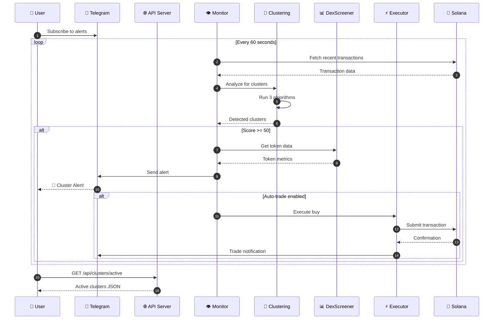

---

## ✨ Features

### 🧠 Smart Money Cluster Detection

Detects coordinated wallet activity before pumps using 3 sophisticated algorithms:

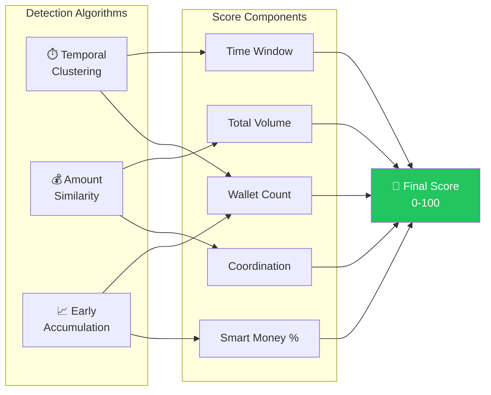

| Algorithm | Description | Weight |
|:----------|:------------|:------:|
| **Temporal** | Wallets buying within 5-minute windows | High |
| **Amount Similarity** | Bot/insider coordinated buys (similar amounts) | Medium |
| **Early Accumulation** | Mass buying before volume spike | High |

### 🚀 Token Graduation Detection

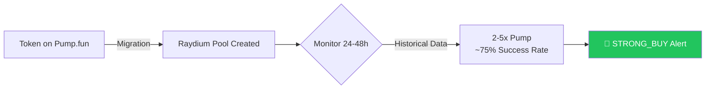

### 🛡️ Safety & Risk Management

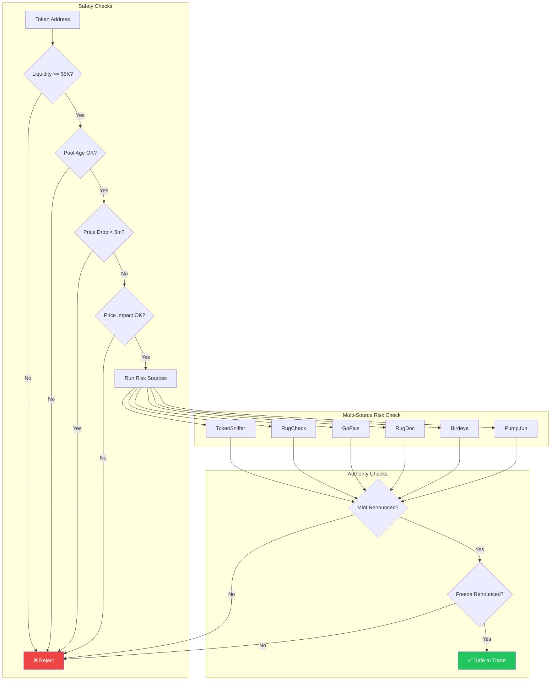

### ⚡ Trading Execution Paths

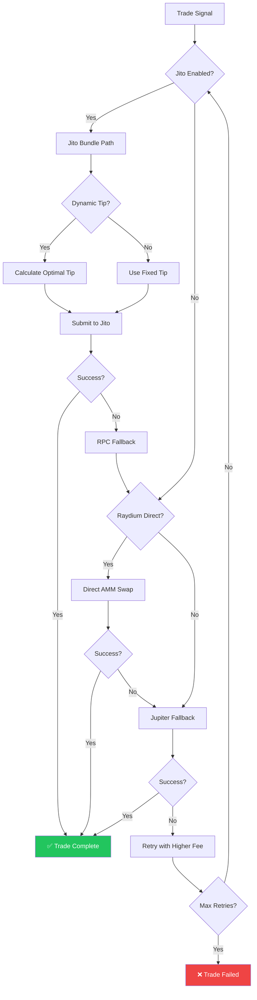

### 📱 Telegram Integration

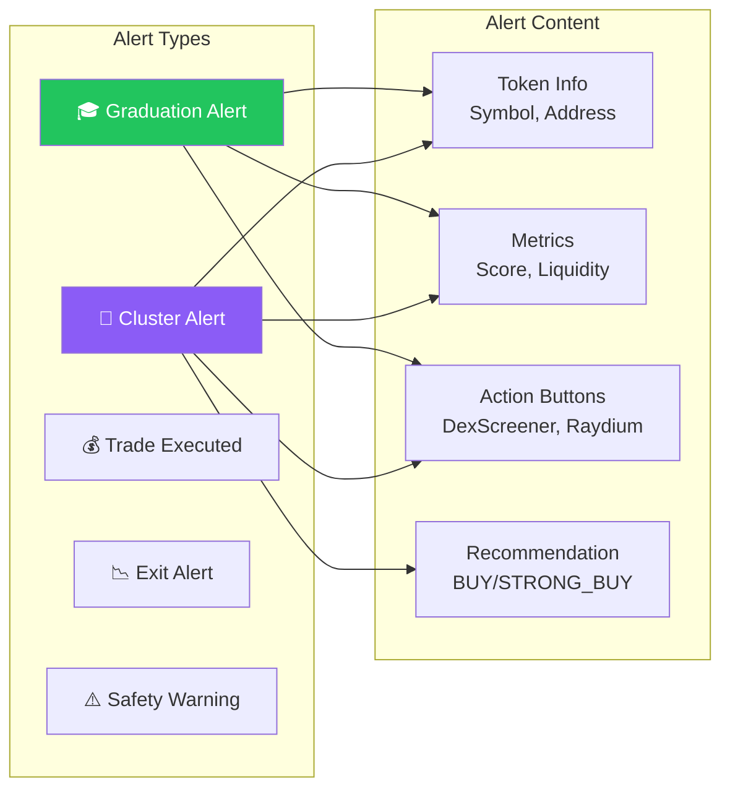

---

## 🚀 Quick Start

### Prerequisites

- Python 3.11+
- Solana RPC endpoint
- Telegram Bot Token (optional)
- Docker (optional)

### Option 1: Docker (Recommended)

```bash
# Clone repository
git clone https://github.com/yourusername/pumpfun-intelligence.git
cd pumpfun-intelligence

# Configure environment
cp backend/.env.example backend/.env
# Edit backend/.env with your settings

# Start services
docker-compose up -d

# View logs
docker-compose logs -f
```

### Option 2: Manual Installation

```bash
# Clone repository
git clone https://github.com/yourusername/pumpfun-intelligence.git
cd pumpfun-intelligence/backend

# Create virtual environment
python -m venv venv
source venv/bin/activate  # Linux/Mac
# or: venv\Scripts\activate  # Windows

# Install dependencies
pip install -r requirements.txt

# Configure environment
cp .env.example .env
# Edit .env with your settings

# Start API server
python src/main_integrated.py

# In another terminal, start monitor
python src/monitor_service.py
```

### Verify Installation

```bash
# Health check
curl http://localhost:5000/health

# Expected response:
{
  "status": "healthy",
  "features": {
    "database": true,
    "dexscreener": true,
    "clustering": true,
    "telegram": true
  }
}
```

---

## ⚙️ Configuration

### Environment Variables Overview

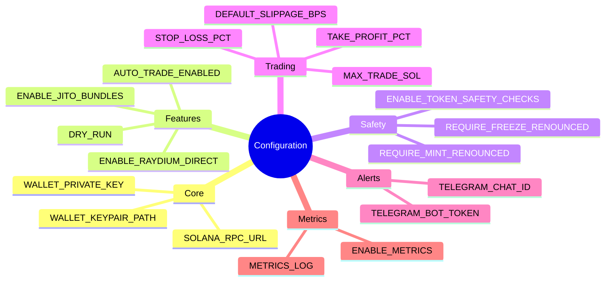

### Key Configuration Groups

<details>
<summary><b>🔗 Core RPC & Wallet</b></summary>

```bash
SOLANA_RPC_URL=https://api.mainnet-beta.solana.com
FALLBACK_RPC_1=https://your-backup-rpc.com
WALLET_KEYPAIR_PATH=/path/to/keypair.json
# OR
WALLET_PRIVATE_KEY=your_base58_private_key
```

</details>

<details>
<summary><b>🎛️ Feature Flags</b></summary>

```bash
AUTO_TRADE_ENABLED=true      # Enable automatic trading
DRY_RUN=false                # Set true to simulate trades
KILL_SWITCH=false            # Emergency stop all trading
ENABLE_JITO_BUNDLES=false    # Use Jito for faster execution
ENABLE_RAYDIUM_DIRECT=true   # Direct AMM swaps
```

</details>

<details>
<summary><b>🛡️ Safety Settings</b></summary>

```bash
ENABLE_TOKEN_SAFETY_CHECKS=true
REQUIRE_MINT_RENOUNCED=true
REQUIRE_FREEZE_RENOUNCED=true
MIN_LIQUIDITY_USD=5000
MAX_PRICE_IMPACT_BPS=500
```

</details>

<details>
<summary><b>💰 Trading Parameters</b></summary>

```bash
MAX_TRADE_SOL=1.0
DEFAULT_SLIPPAGE_BPS=100
TAKE_PROFIT_PCT=100          # 2x = 100% profit
STOP_LOSS_PCT=25             # Exit at 25% loss
TRAILING_STOP_PCT=15         # Trail by 15%
MAX_HOLD_MINUTES=120
```

</details>

<details>
<summary><b>📱 Telegram Setup</b></summary>

```bash
TELEGRAM_BOT_TOKEN=123456:ABC-DEF...
TELEGRAM_CHAT_ID=123456789
TELEGRAM_ALERT_ON_SUCCESS=true
TELEGRAM_ALERT_ON_FAILURE=true
```

**Setup Steps:**
1. Message [@BotFather](https://t.me/BotFather) → `/newbot`
2. Copy the bot token
3. Message your bot, then visit: `https://api.telegram.org/bot<TOKEN>/getUpdates`
4. Find and copy your `chat_id`

</details>

---

## 📡 API Reference

### Endpoints Overview

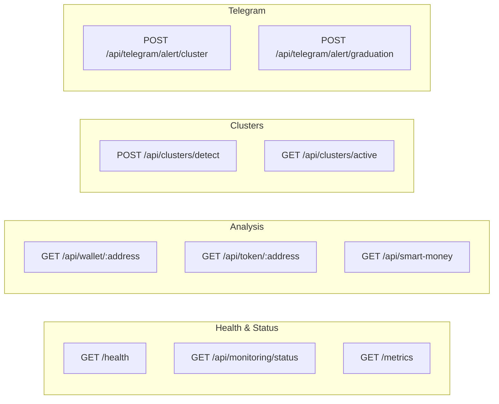

### Endpoint Details

| Method | Endpoint | Description |
|:------:|:---------|:------------|
| `GET` | `/health` | Health check and feature status |
| `GET` | `/api/wallet/<address>` | Analyze wallet activity |
| `GET` | `/api/token/<address>` | Get token data with graduation status |
| `POST` | `/api/clusters/detect` | Trigger cluster detection |
| `GET` | `/api/clusters/active` | List active clusters |
| `GET` | `/api/smart-money` | Find high win-rate wallets |
| `GET` | `/metrics` | Prometheus-format metrics |

### Example Requests

```bash
# Analyze a token
curl http://localhost:5000/api/token/EPjFWdd5AufqSSqeM2qN1xzybapC8G4wEGGkZwyTDt1v

# Detect clusters in last hour
curl -X POST http://localhost:5000/api/clusters/detect \
  -H "Content-Type: application/json" \
  -d '{"hours": 1}'

# Get active clusters
curl http://localhost:5000/api/clusters/active

# Find smart money wallets
curl http://localhost:5000/api/smart-money?limit=50
```

---

## 📊 Monitoring & Metrics

### Prometheus Metrics

The `/metrics` endpoint exposes Prometheus-compatible metrics:

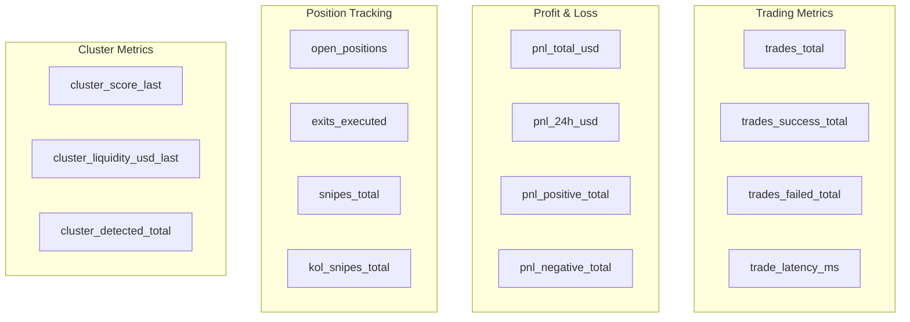

### Grafana Dashboard Setup

```yaml
# Example Prometheus scrape config
scrape_configs:
  - job_name: 'pumpfun-intelligence'
    scrape_interval: 10s
    static_configs:
      - targets: ['localhost:5000']
```

**Recommended Panels:**
- Trade latency (p50/p90/p99)
- Success rate over time
- PnL cumulative chart
- Open positions gauge
- Cluster scores histogram

---

## 🔄 Trading Flows

### Auto-Trade Decision Flow

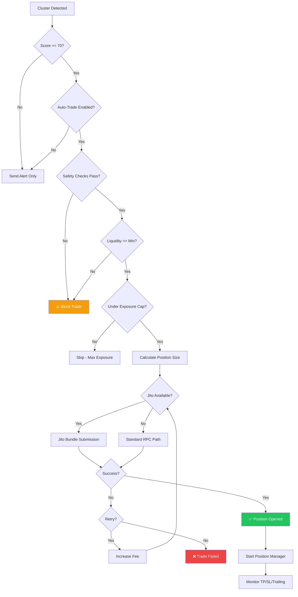

### Position Exit Flow

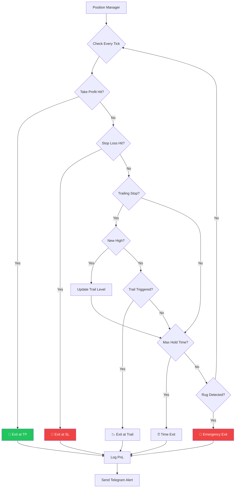

---

## 💾 Database Schema

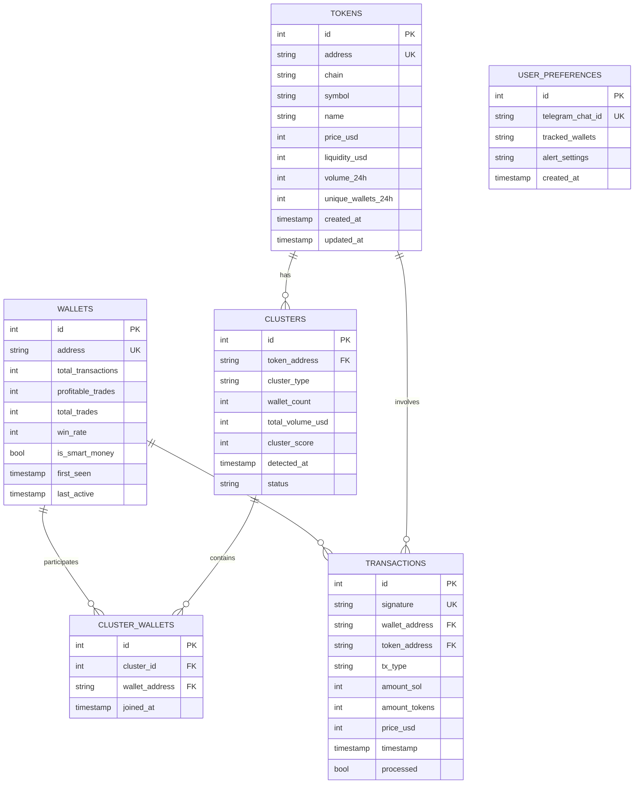

---

## 📁 Project Structure

```
pumpfun-intelligence/
├── backend/
│   ├── src/
│   │   ├── main_integrated.py       # 🌐 Flask API server
│   │   ├── monitor_service.py       # 👁️ Real-time monitoring
│   │   ├── clustering_service.py    # 🧠 THE MONEY-MAKER
│   │   ├── database.py              # 💾 SQLite persistence
│   │   ├── dexscreener_api.py       # 📊 Token data integration
│   │   ├── telegram_service.py      # 📱 Rich notifications
│   │   ├── solana_api.py            # 🔗 Solana blockchain
│   │   ├── executor.py              # ⚡ Trade execution
│   │   ├── position_manager.py      # 💼 Position tracking
│   │   ├── snipe_executor.py        # 🎯 Snipe execution
│   │   ├── kol_watcher.py           # 👀 KOL monitoring
│   │   ├── kol_sniper.py            # 🎯 KOL sniping
│   │   ├── bundle_detector.py       # 📦 Bundle detection
│   │   ├── bundle_sniper.py         # 🎯 Bundle sniping
│   │   ├── geyser_watcher.py        # 🔌 Geyser websocket
│   │   ├── raydium_direct/          # 🔄 Direct AMM swaps
│   │   │   ├── pool_parser.py
│   │   │   ├── amm_math.py
│   │   │   └── ix_builder.py
│   │   ├── trading/                 # 💰 Trading utilities
│   │   │   ├── sizing.py
│   │   │   ├── fee_tuner.py
│   │   │   ├── token_safety.py
│   │   │   ├── metrics.py
│   │   │   └── auto_pause.py
│   │   └── risk_sources.py          # 🛡️ Risk assessment
│   ├── logs/                        # 📋 Application logs
│   ├── requirements.txt             # 📦 Python dependencies
│   ├── Dockerfile                   # 🐳 Container config
│   └── .env.example                 # ⚙️ Configuration template
├── docker-compose.yaml              # 🐳 Multi-container setup
├── docs/                            # 📚 Documentation
└── README.md                        # 📖 This file
```

---

## 💡 Pro Tips

| # | Tip | Why |
|:-:|:----|:----|
| 1 | **Act Fast** | Clusters are time-sensitive (5-15 minute window) |
| 2 | **Trust the Score** | 70+ = strong signal, don't hesitate |
| 3 | **Watch Graduations** | Historically most profitable signal |
| 4 | **Avoid Low Liquidity** | <$5K = extreme rug pull risk |
| 5 | **Copy Smart Money** | Follow wallets with 60%+ win rates |
| 6 | **Set Telegram Alerts** | Don't miss opportunities |
| 7 | **Take Profits** | 2-3x is excellent, don't get greedy |
| 8 | **Use Stop Losses** | Protect your capital |
| 9 | **Start Small** | Test the system with small amounts first |
| 10 | **Track Performance** | Database stores all data for analysis |

---

## 📈 Roadmap

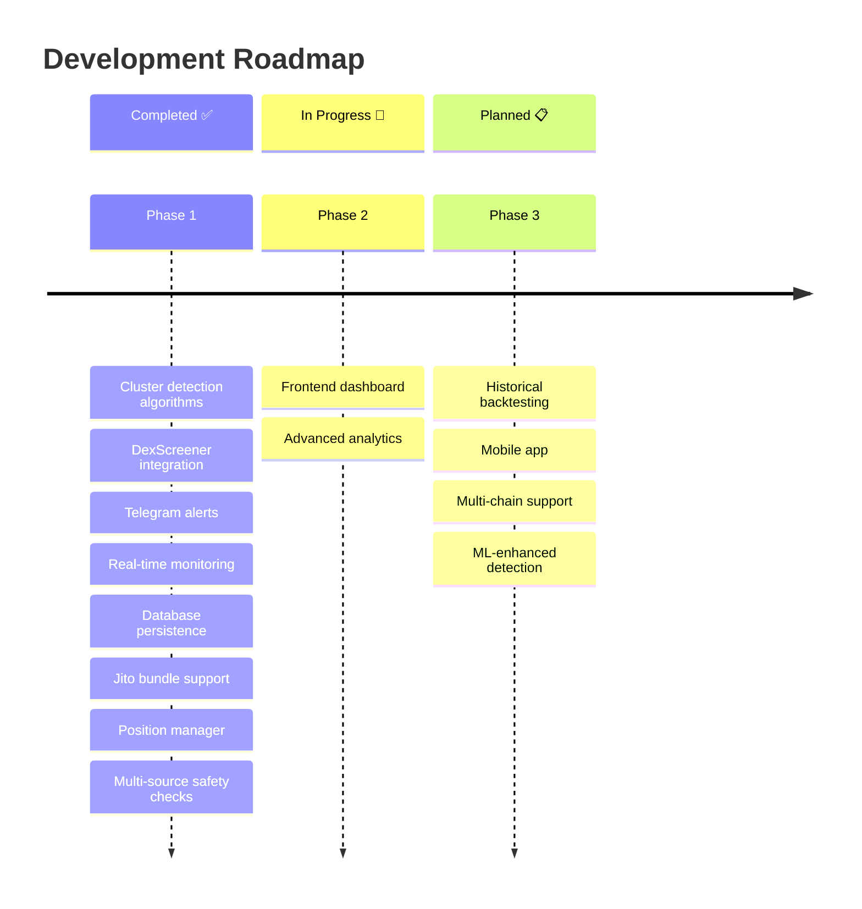

---

## 🤝 Contributing

Contributions are welcome! Please follow these steps:

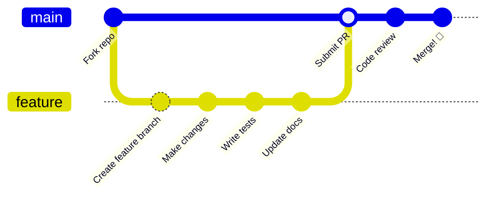

1. Fork the repository
2. Create a feature branch (`git checkout -b feature/amazing-feature`)
3. Make your changes
4. Write tests if applicable
5. Update documentation
6. Submit a pull request

---

## ⚠️ Disclaimer

> **This software is for educational and informational purposes only.**
> 
> Cryptocurrency trading involves substantial risk of loss. This platform provides trading signals and automation tools, but does not guarantee profits. Past performance does not indicate future results.
> 
> **Always:**
> - Do your own research (DYOR)
> - Never invest more than you can afford to lose
> - Understand the risks of automated trading
> - Test thoroughly with small amounts first

---

## 📝 License

MIT License - See [LICENSE](LICENSE) file for details.

---

## 📞 Support

- **GitHub Issues**: Report bugs and request features
- **Documentation**: See `/docs` folder
- **Telegram Community**: Coming soon

---

<div align="center">

**Stop trading blind. Start trading with intelligence.** 🚀💰

*Built with intelligence. Designed for profit.*

[](https://github.com/yourusername/pumpfun-intelligence)

</div>
]]>
